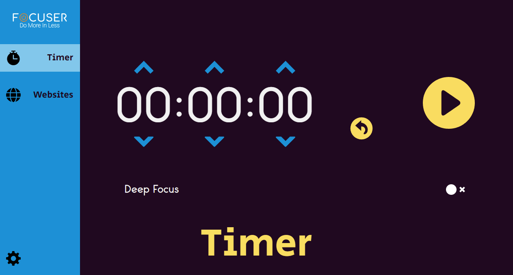

_A free & opensource distraction-reducing app for maximizing your productivity - built in electronJS!_

## Where Am I?

Welcome! This GitHub repo hosts the F0cuser desktop application, which allows you to block web access to any website you want (and by blocking, we don't only mean access through your browser, but **all access**).

## Why Is This A Thing?

You probably know about several browser extensions and even an application or two that allow you to do pretty much the same thing, *but there are a few downsides*:

1. Browser extensions only work on the browser they are installed on.
2. Some apps don't fully block access to websites.
3. Most apps are closed-source, and can potentially log personal data.
4. More advanced apps require a subscription to be fully utilized.

As of now, F0cuser might not be quite on the same level as the more established applications already on the market, but it is slowly getting there with more features and fixes added every week.

## Is It Safe?
Yes! Since all of the processes are done locally, no data is ever sent to either focuser or other parties.

In order to function correctly (not display an insecure SSL warning on each request), the program has to install a root certificate using a PowerShell script as an administrator, which is why you might get a warning regarding admin execution during installation. __This is the only reason for the admin rights request!__

## Sounds Great, How Do I Use It?

You can download the latest version from the **Releases** tab, and after a quick installation (The app will be installed on the AppData/Local folder) you will be able to start the app and pick the websites you wish to block *- Yes, it is that easy*.

## Can I Help?

Of course! After all, this is still GitHub and you are more than free to fork this repo, make your edits and create a pull request (Just make sure to follow coding standards for JS/TS and Python).

After a short review process and possible modifications the request will be merged into the main branch, and a new version will be released!

